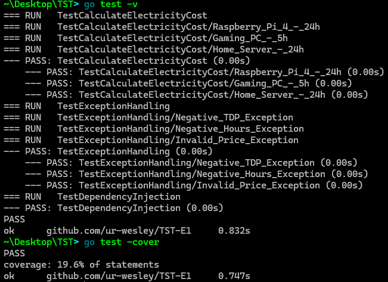

# stromkosten rechner für TST-E1

ich habe für home assistant und home server ein kleines tool erstellt, womit ich die stromkosten berechnen kann. das tool habe ich künstlich aufgebohrt mit dependency injection und tests.

## verwendung

```
go run . -tdp 15 -hours 24 -price 0.30
go run . -tdp 100 -monthly
go run . -help
```

beispiele:

- raspberry pi 4: `go run . -tdp 15 -hours 24 -price 0.30`
- home server: `go run . -tdp 150 -monthly -price 0.25`

## tests ausführen

```
go test
go test -v
go test -cover
```

### ausführung:


